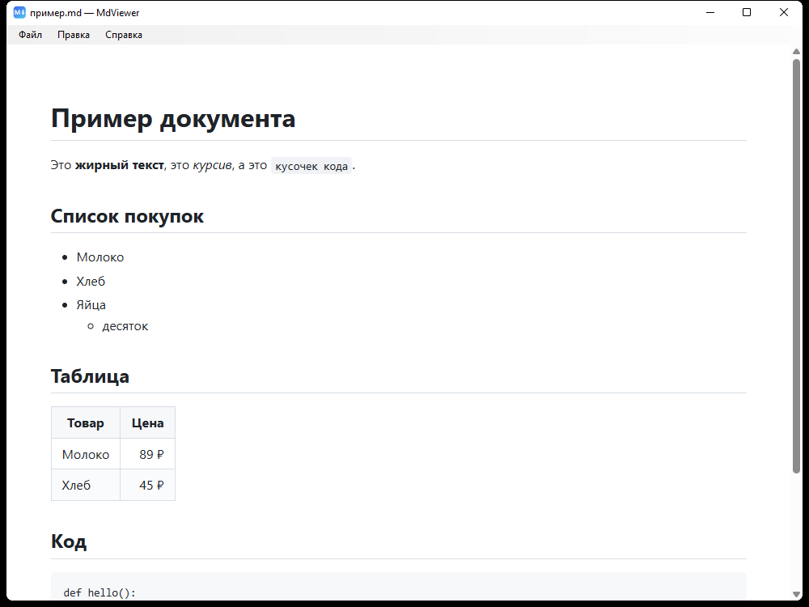

# MdViewer

*Read this in other languages: [Русский](README.ru.md)*

A tiny, fast Markdown viewer for Windows with editing, printing and PDF export.
The whole app is under 2 MB and needs nothing installed — it uses the .NET
Framework 4.8 and the Edge WebView2 engine already built into Windows 10/11.



## Features

- **View** Markdown files with GitHub-like styling: headings, lists, tables,
  code blocks, quotes, images (including relative paths)
- **Edit** in a simple Notepad-style text mode (`Ctrl+E`), with unsaved-changes
  protection; original line endings (LF/CRLF) are preserved on save
- **Print** to any printer with preview, or **export to PDF** in one click
- Open files via dialog (`Ctrl+O`), drag & drop, command line
  (`MdViewer.exe file.md`) or double-click (after file association)
- External links open in your default browser; links to neighbouring `.md`
  files open right in the viewer
- Russian user interface

## Download

Grab the latest build from the [Releases](../../releases) page — unpack
anywhere and run `MdViewer.exe`. No installation required.

**Requirements:** Windows 10/11 x64. Both the .NET Framework 4.8 runtime and
the WebView2 runtime ship with Windows 11 (on older Windows 10 builds you may
need to install the
[WebView2 Runtime](https://developer.microsoft.com/microsoft-edge/webview2/)).

## Building from source

Visual Studio 2022 (with .NET desktop workload) or the .NET SDK:

```
dotnet build MdViewer.sln -c Release
```

The result appears in `MdViewer/bin/Release/net48/`.

Dependencies (restored automatically from NuGet):

- [Markdig](https://github.com/xoofx/markdig) — Markdown to HTML conversion
- [Microsoft.Web.WebView2](https://developer.microsoft.com/microsoft-edge/webview2/) — rendering

## License

[MIT](LICENSE)
